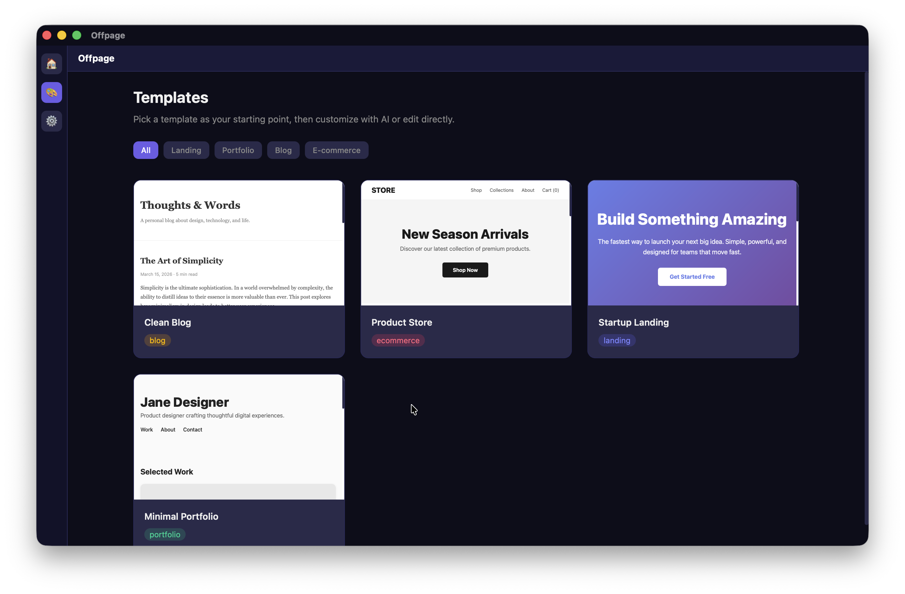

<div align="center">

<br>

<picture>
  <source media="(prefers-color-scheme: dark)" srcset="docs/assets/logo-dark.svg">
  <source media="(prefers-color-scheme: light)" srcset="docs/assets/logo-light.svg">
  
</picture>

<br><br>

### Generate websites with AI — entirely on your device.

No cloud. No API keys. No subscriptions. Full privacy.

<br>

[](https://github.com/Szymon0C/Offpage)
[](#download)
[](#download)
[](https://tauri.app)
[](#license)

<br>



<br><br>

[**Download**](#download) &nbsp;&middot;&nbsp; [**Getting Started**](#getting-started) &nbsp;&middot;&nbsp; [**Features**](#features) &nbsp;&middot;&nbsp; [**Contributing**](#contributing)

<br>

</div>

---

## Features

<table>
<tr>
<td width="50%" valign="top">

**Prompt to page** &mdash; Describe what you want, AI generates the entire website from scratch.

**Template gallery** &mdash; Start from curated templates (landing pages, portfolios, blogs, e-commerce) and customize with natural language.

**Chat editing** &mdash; *"Make the header dark blue and add a CTA button"* &mdash; done.

</td>
<td width="50%" valign="top">

**Inline editing** &mdash; Click any section, prompt changes just for that part.

**Visual editing** &mdash; Edit text directly on the page &mdash; WYSIWYG, no code.

**One-click deploy** &mdash; Publish to Netlify, Vercel, or GitHub Pages instantly. Or export as a standalone HTML file.

</td>
</tr>
</table>

> Output is a single HTML file with inline CSS/JS &mdash; works everywhere.

<br>

## How It Works

```
  You type a prompt
       |
       v
  +------------+    Tauri IPC    +----------------+    HTTP    +----------------+
  |  Frontend   | <============> |   Rust Core    | <=======> |  llama.cpp     |
  |  React 19   |                |   (Tauri 2.0)  |           |  (local AI)    |
  +------------+                 +----------------+           +----------------+
       |                                |
       | postMessage                    | SQLite
       v                                v
  +------------+                 +----------------+
  |  Preview   |                 |    Storage     |
  |  (iframe)  |                 |  Projects, AI  |
  +------------+                 +----------------+
```

Everything runs locally. The AI model is downloaded once and stays on your machine.

<br>

## Tech Stack

| Layer | Technology |
|:------|:-----------|
| **Frontend** | React 19 &middot; TypeScript &middot; Vite &middot; Tailwind CSS 4 &middot; Zustand |
| **Desktop** | Tauri 2.0 (Rust) |
| **AI** | llama.cpp sidecar &middot; Qwen2.5-Coder-7B (3B fallback) |
| **GPU** | Metal (macOS) &middot; CUDA / Vulkan (Windows) |
| **Storage** | SQLite (projects, chat history, snapshots, settings, templates) |
| **Deploy** | Netlify &middot; Vercel &middot; GitHub Pages &middot; Local HTML export |

<br>

## Getting Started

### Prerequisites

- **Node.js** 18+ &mdash; [nodejs.org](https://nodejs.org)
- **Rust** &mdash; [rustup.rs](https://rustup.rs)
- **pnpm** (recommended) or npm

<details>
<summary><strong>macOS extras</strong></summary>

```bash
xcode-select --install
```

</details>

<details>
<summary><strong>Windows extras</strong></summary>

Install [Microsoft C++ Build Tools](https://visualstudio.microsoft.com/visual-cpp-build-tools/) and [WebView2](https://developer.microsoft.com/en-us/microsoft-edge/webview2/).

</details>

### Clone & Install

```bash
git clone https://github.com/Szymon0C/Offpage.git
cd Offpage
pnpm install        # or: npm install
```

### Download the AI sidecar

```bash
bash scripts/setup-sidecar.sh
```

This downloads the pre-built `llama-server` binary (b7472) for your platform.

### Run in development

```bash
pnpm tauri dev      # or: npx tauri dev
```

The app will open automatically. On first launch:

1. Hardware detection runs automatically
2. Choose a model (7B recommended for 16 GB+ RAM, 3B for 8 GB)
3. Click **Download & Start AI** &mdash; one-time download from Hugging Face
4. Start chatting!

### Build for production

```bash
pnpm tauri build    # or: npx tauri build
```

Builds a distributable `.dmg` (macOS) or `.msi` / `.exe` (Windows) in `src-tauri/target/release/bundle/`.

<br>

## Hardware Requirements

| | Hardware | Experience |
|:--|:---------|:-----------|
| **Minimum** | 8 GB RAM, x64 (AVX2) or Apple Silicon | Works &mdash; CPU inference, slower |
| **Recommended** | 16 GB RAM, 6 GB+ VRAM or M1+ | Smooth generation |
| **Optimal** | 32 GB RAM, RTX 3060+ or M1 Pro+ | Fast, room for larger models |

The app detects your hardware and adjusts automatically (quantization, model size).

<br>

## App Pages

| Page | Description |
|:-----|:------------|
| **Home** | Create new projects or open recent ones |
| **Project** | Chat with AI, preview generated site, inline/WYSIWYG editing, deploy |
| **Templates** | Browse curated templates by category, preview, customize with AI |
| **Settings** | AI model status & control, deploy token management, about |

<br>

## Project Structure

```
Offpage/
├── src/                          # React frontend
│   ├── components/
│   │   ├── chat/                 # ChatPanel, ChatInput, ChatMessage, ModelSetup
│   │   ├── deploy/               # DeployModal (Netlify, Vercel, GitHub Pages)
│   │   ├── layout/               # AppShell, Sidebar, TopBar
│   │   ├── preview/              # PreviewFrame, PreviewToolbar, InlineEditBar
│   │   ├── templates/            # TemplateCard, TemplatePreviewModal
│   │   ├── ui/                   # IconButton
│   │   └── ErrorBoundary.tsx     # Global error boundary
│   ├── stores/                   # Zustand state management
│   │   ├── aiStore.ts            # Sidecar status, hardware info, model download
│   │   ├── chatStore.ts          # Chat messages, streaming buffer
│   │   ├── deployStore.ts        # Deploy status, token management
│   │   ├── editorStore.ts        # Edit mode, viewport size, section selection
│   │   ├── projectStore.ts       # Projects CRUD, snapshots, deploy config
│   │   └── templateStore.ts      # Template loading, category filtering
│   ├── pages/                    # Route pages
│   │   ├── HomePage.tsx          # Project list + create
│   │   ├── ProjectPage.tsx       # Chat + preview + editing workspace
│   │   ├── TemplatesPage.tsx     # Template gallery with category filters
│   │   ├── SettingsPage.tsx      # AI model, deploy tokens, about
│   │   └── NotFoundPage.tsx      # 404 catch-all
│   ├── hooks/
│   │   └── useAiStream.ts        # SSE streaming from llama-server via Tauri events
│   ├── lib/
│   │   ├── prompts.ts            # System prompts for generate/edit/section modes
│   │   ├── bundledTemplates.ts   # 4 built-in HTML templates
│   │   ├── deployProviders.ts    # Provider metadata (Netlify, Vercel, GitHub Pages)
│   │   ├── helperScript.ts       # JS injected into preview iframe
│   │   ├── htmlSections.ts       # Section replace/tag utilities
│   │   └── iframeBridge.ts       # Typed postMessage protocol
│   ├── db/
│   │   ├── database.ts           # SQLite init, migrations, template seeding
│   │   └── migrations.ts         # Schema: projects, snapshots, chat, templates, settings
│   └── types/
│       └── project.ts            # TypeScript types for all DB entities
├── src-tauri/                    # Rust backend (Tauri 2.0)
│   └── src/
│       ├── lib.rs                # Plugin registration, command handler
│       ├── ai.rs                 # SSE streaming from llama-server
│       ├── sidecar.rs            # llama-server lifecycle (spawn, health check, kill)
│       ├── models.rs             # Model download with progress events
│       ├── deploy.rs             # Deploy to Netlify/Vercel/GitHub Pages + HTML export
│       └── hardware.rs           # RAM, CPU, GPU detection and tier classification
├── scripts/
│   └── setup-sidecar.sh          # Downloads pre-built llama-server binary
└── docs/                         # Specs, plans, assets
```

<br>

## Deploy

Offpage supports deploying generated websites to three platforms:

| Provider | How it works |
|:---------|:-------------|
| **Netlify** | Creates a site via API, deploys a zip with `index.html`. Reuses existing site on subsequent deploys. |
| **Vercel** | Posts base64-encoded HTML to the deployments API. |
| **GitHub Pages** | Creates a repo, uploads `index.html`, enables GitHub Pages. |
| **Local export** | Saves the HTML file to any location on your disk via system save dialog. |

API tokens are stored locally in SQLite &mdash; never sent anywhere except the provider's API. Tokens can be managed in **Settings**.

<br>

## AI Model

The app runs AI inference locally using [llama.cpp](https://github.com/ggerganov/llama.cpp) as a sidecar process.

| Model | Size | For |
|:------|:-----|:----|
| **Qwen2.5-Coder-7B-Instruct** (Q4_0) | ~4.3 GB | 16 GB+ RAM &mdash; recommended |
| **Qwen2.5-Coder-3B-Instruct** (Q4_0) | ~2.0 GB | 8 GB RAM &mdash; minimum |

Models are downloaded from Hugging Face on first launch and stored in your app data directory. The app auto-detects previously downloaded models on subsequent launches.

<br>

## Contributing

Contributions are welcome! The project is in active development.

```bash
# Fork & clone, then:
pnpm install
bash scripts/setup-sidecar.sh
pnpm tauri dev
```

Please open an issue before submitting large PRs so we can discuss the approach.

<br>

## Download

> **Coming soon** &mdash; Early builds will be available once the core features are stable.

Star or watch this repo to get notified.

<br>

## License

MIT &mdash; see [LICENSE](LICENSE) for details.

<br>

<div align="center">

<sub>Built with Tauri, React, and local AI. No data leaves your device.</sub>

</div>
